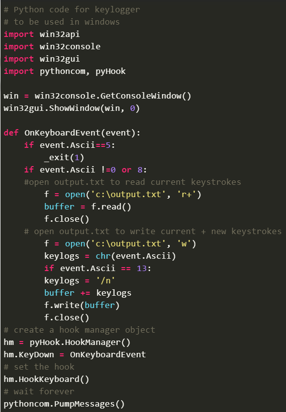
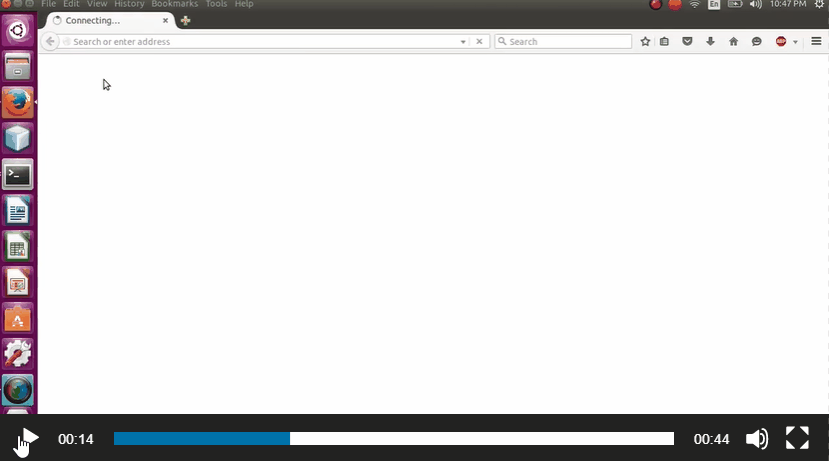
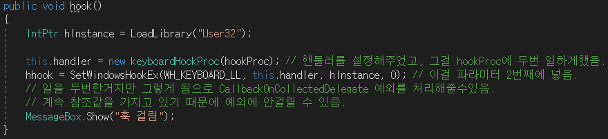
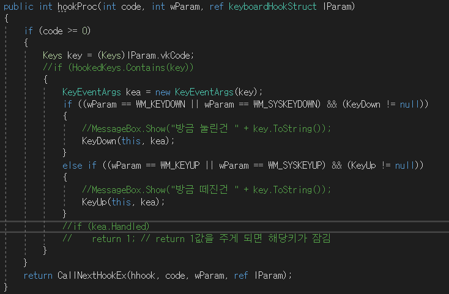
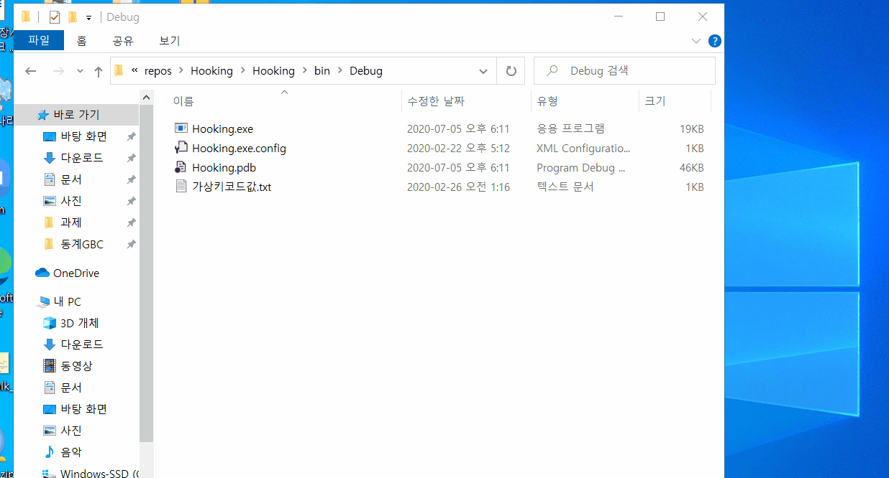

# GBC-security 1번 과제
## 과제는 1,2,3번 중 한가지를 선택해서 하는 것인데, 나는 그 중 3번을 선택했다.
---
### ~~각설하고 본론으로 바로 들어가보자..~~
---
**TODO**: 실제 사례를 찾아보자  
- 악성코드(아무 악성코드의 소스코드를 가져옵시다)
    - Backdoor, DDoS, 도청 및 감시, Virus Ransomware, Worm, Trojan(트로이 목마), KeyLogger, RootKit 등등등  
---
별로 쓸데없는 부분..  
사실 나는 예전부터 게임을 하며, 매크로, 핵에 관심이 많았다.  
단순 키보드를 눌러주는 매크로 혹은 엄청난 기능을 하는 핵.. 등에 관심이 많았는데, 그래서 예전부터 지금까지 진행중인 프로젝트가 몇가지 있다.  
그 중, 비슷한 주제인 <u>**KeyLogger**</u>으로 과제를 해보겠다.  
~~지금부터 읽으시면 될 것 같습니다.~~

---
~~나는 김광교수님이 하시는 19년도 동계방학 Programming Solving 시간에도 느꼈었지만, Python이 대단하다고 느꼈는데, c++과 비교해서, 소스가 굉장히 짧았다.~~  
KeyLogging 의 정의.  
> Keystroke loggin의 약자로, 말 그대로 사용자의 키보드 입력을 추적, 기록한다는 의미.  

실제로, 미국 정보수사기관 FBI는 1999년 필라델피아 지역의 마피아 보스인 니코데모 스카프로 주니어를 추적, 검거하는 과정에서 키로거 설치 전략을 활용한 것으로 알려져 있다.  
FBI는 스카프로의 모든 키보드 입력 기록을 추적했고, 해당 정보를 바탕으로 기소 혐의를 구체화할 수 있었다. [출처](https://www.itworld.co.kr/news/105401)  

---

본 HW-1은 [This Link](https://www.geeksforgeeks.org/design-a-keylogger-in-python/)  를 참고하였음.  
Python의 가장 큰 장점이라고 할 수 있는 다양한 라이브러리를 이용하여, KeyLogger를 만들고, 그 소스를 첨부할 것이다.  
(내가 만든것이 아닌, 인터넷에서 조사한 것임.)  
  
우선 이 프로젝트를 위해서, pyHook과 win32 라이브러리가 필요하다.
> 준비물 : pyHook, win32라이브러리 그리고 Python 환경.  
Install Link: [pyHook](https://www.lfd.uci.edu/~gohlke/pythonlibs/#pyhook)  [win32](https://www.lfd.uci.edu/~gohlke/pythonlibs/#pywin32)  

**Source**  [출처](https://www.geeksforgeeks.org/design-a-keylogger-in-python/)  
  
**Result**  [출처](https://www.geeksforgeeks.org/design-a-keylogger-in-python/)  
  
위 그림처럼, 자신이 타이핑한 정보들이 저장이 txt에 저장이 되는데, 이를 악용해서 어떠한 홈페이지에 login을 할 때, id, pw를 메일로 보내게끔 많이 만든다고 한다.  

사실 이것은 내가 앞서 말했던 게임 매크로에 응용이 될 수 있다.  
가령, 키보드 F1을 눌렀을 때, abcde콤보를 넣고싶다고 가정해보자.(꼭 abcde콤보가 아니더라도, F1한번에 동해물과 백두산이 마르고 닳도록이라는 문장을 키입력 한번만에 쓸 수 있다.)  

KeyLogger와 똑같이 F1이 눌렸음을 계속 감지하다가, F1이 감지되었으면, 그에 맞는 명령을 실행시켜주면 된다.  
흔히 말하는 Hotkey가 만들어지는 것이다.  

---
사실 내용이 부실할 수 있다고 생각한다.  
그래서 나는 예전에 내가 c#으로 만들었던 KeyLogger의 동작에 대해 아주 간단히 설명하려고 한다.(~~Python은 깊이 모르기때문에.~~)  

**작동법**  
먼저 Global Hooking이라는 것을 사용한다.  Global Hooking은 전역적으로 Hook을 걸어놓는다는 의미인데, 지금 실행중인 프로세스만이 아닌, 전역적으로 모든 프로세스에서 Hooking을 할 것이라는 의미이다.  
C언어에서 GetKeyState??인가 그런 함수가 있는데, 또 keybd hit? 비슷한 함수가 있다. 이것은 콘솔에서 어떤 키가 눌렸는지 작동은 하지만, 특정 사이트에서 id pw를 빼내오고 싶다면, 사용할 수 없는 기술이다. 따라서, 우리는 전역적인 후킹이 필요하다.(~~물론 다른방법도 있겠지만..~~)  

1. 내가 Hook을 걸고싶은 키를 등록한다.(KeyLogger의 경우, 키 등록 부분을 없애고 모든 키를 취급하면 된다.)  
2. LoadLibrary로 User32.dll을 참조한다.  
3. hookProc로 handler를 설정하고 SetWindowsHookEx라는 함수로 Hook을 건다. 이때까지를 쉽게 말하면, 키를 등록한다고 보면 된다.  
4. hookProc는 계속 키가 눌릴때마다 호출이 된다.  그리고는 다음 그림과 같이 키가 등록된지 아닌지를 체크하고, 후에 명령을 주면 KeyLogger가 되거나, KeyMapping을 통한 HotKey설정이 가능하다.
  
  
이것만 본다면 이해가 어렵겠지만, Form을 이용해 이리저리 많은 기능이 섞여있으므로, 딱 핵심인 훅 프로시저 부분만 첨부한다.  
---
**마치며..**  
이 프로젝트는 개발이 멈추긴 했지만 key.ini를 통해 KeyMapping을 사용자가 직접 시켜주며, ImageSearch부분과 자동사냥 등 많은 기능이 함께 있거나 개발중이기 때문에 모든 전체의 소스공개는 어려운 것을 양해 해주길 바란다.  
마지막은 프로그램이 돌아가는 영상이다.  
  