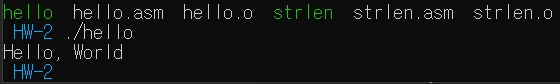

# GBC Security HW-2  


1. 어셈블리어로 된 프로그램을 분석해보세요.   
  분석에 앞서, 어셈블리 프로그램은 3가지 영역으로 나뉜다.
- 데이터 영역  
  -  초기값이 있는 전역 변수, 혹은 static 변수 등이 들어감.   
- bss 영역  
  -  변수들이 여기에 있음.  
- 텍스트 영역  
  -  실행할 코드가 있음.
  -  반드시 global _start 와 함께 시작되어야함.  
  이는 커널에게 프로그램 실행 시작점이 어딘지 말해준다.

- 분석(hello.asm)  
```
global  _start
section .text
_start:
```
- global : 특정 심볼을 global로 정의함.  
  global _start는 링커를 위해 반드시 정의되어야한다.  
  어셈블리어는 모든 코드가 기본적으로 private이다.   
- section : section을 정의함.  
  text section은 일반적으로 코드가 들어감.  
- _start: 링커에게 시작지점을 알려줌.(entry point) 
```  
    mov       rax, 2
    mov       rdi, 1
    mov       rsi, message
    mov       rdx, 13
    syscall
```  

rax에 따라 syscall로 불러오는 함수가 다르다.  
매개변수는 다른 레지스터에서 받는다.  
  
이는 rax가 1일때와 60일때의 예시이다.  
즉, 위소스는 rax에 1을 넣어 syscall의 번호가 1번임을 말해주고, 이는 sys_write하겠다는 의미이고,  
rdi에 1을 넣어줬는데, 이는 stdout(출력)을 뜻한다.  
rsi에 message라는 포인터 변수를 넣는다.  
rdx에 길이 13을 넣고 syscall을 한다.  

여기서 message에 있는 msg가 출력된다.  
```  
    mov       rax, 60
    xor       rdi, rdi
    syscall
```  
위 표를 한번 더 참고하면 알겠지만, rax에 60을 넣어, sys_exit함수를 불러올것이다.  또한, rdi와 rdi로 xor 논리연산을 진행하는데, 동일한 두 수를 xor할 경우, 0이 나온다.  
즉, mov rdi, 0과 같다.  
이 부분은 에러코드 0을 넣어 종료하는 syscall이다.  
즉, 이 부분에서 종료된다.  
```
    section   .data
    message:
    db        "Hello, World", 10
```  

data section이다.  
message에 db 데이터 타입(byte)으로 문자열을 넣어주고, 10은 개행을 의미한다.  
- output  
  