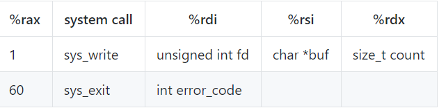
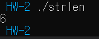

# GBC Security HW-2  


1. 어셈블리어로 된 프로그램을 분석해보세요.

- 분석(strlen.asm)  

```  
BITS 64

section .text
global _start
```   
- global _start는 링커를 위해 반드시 정의되어야한다.  
text section은 일반적으로 코드가 들어감.  
- _start: 링커에게 시작지점을 알려줌.(entry point)  

```
strlen:
mov rax,0                  
.looplabel:
cmp byte [rdi],0           
je  .end                    
inc rdi                     
inc rax                    
jmp .looplabel            
.end:
ret                      
```  
- strlen라는 함수는  
처음에 rax에 0을 넣는다.  이는 나중에 return값으로 활용된다.  
즉, count역할을 해줌.  
looplabel은 서브루틴이라고 생각하면 된다.  
rdi의 주소가 가리키는 byte 부분이 NULL인지 비교하고, je로 그 결과가 같다면, end 서브루틴으로 간다. c언어의 goto와 같다.  
je에 안걸렸다면, 즉 msg[count] 가 NULL이 아니라면, rdi와 rax 1 증가.  
goto looplabel로 감.  
end루틴으로 점프했다면, 함수를 종료하고 rax 레지스터 반환.  

```c  
int strlen(char msg[])
{
    int result=0;
    while(1)
    {
        if (msg[rdi] == 0)
            break; // goto, end
        rdi++;
        result++;
    }
    return count;
}
```  
c언어로 표현한다면 이렇게 될 것이다.  
즉, strlen를 return해주는 부분이면서, strlen라는 이름을 가진 함수이다.  

```  
_start:
mov   rdi, msg              
call  strlen
```  
- 시작부분, rdi에 msg를 넣는다.  
strlen 함수 호출.  

```  
add   al, '0'               
mov  [len],al            
mov   rax, 1           
mov   rdi, 1          
mov   rsi, len       
mov   rdx, 2        
syscall           
```  
- rax가 64-bit register이고, al은 8-bit register이다.  
rax나 al이나 같지만, 비트수가 다르다.  많은 비트는 필요없기에, al을 썼고, al에 '0'을 더한 값이 저장된다.  
이 부분이, 숫자를 char형으로 표현하기 위함이다.  
그걸 len 주소가 가리키는 byte부분에 넣는다.  
즉, len[0]에 al값을 넣는것이다.  
아래 표와 같이,  
rax에 1, rdi에 1(stdout), rsi에 len, rdx에 2를 넣고 syscall을 하면, sys_write를 해줌.  
즉, 구한 len를 print해줌.  

  

```  
mov   rax, 60    
mov   rdi, 0    
syscall        
```  
- 종료. rax에 60을 넣고, rdi에 0을 넣음.  
  
표를 보면, rax에 60, rdi에 error code 넣고 syscall은 sys_exit을 의미. error code에 0이 들어가면서 안전하게 종료됨.  

```  
section .data
msg db "hello",0xA,0        
len db 0,0xA
```  
- 데이터 섹션.  
msg를 byte타입으로 "hello"로 초기화, 0xA 는 10진수로 10을 뜻함.  10은 개행을 의미하고, 0은 문자열의 마지막을 나타냄.   
len를 byte타입 0을 넣고, 개행.  

---
output:  
  