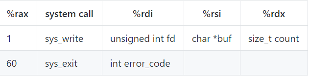

# GBC_security HW-3 

1. 자신의 실험 결과에 대한 write-up 을 쓰세요. 

    - 사람은 어떤 학문을 이해하든지 간에 그 학문이 정말로 맞는지 확인하기 위해 자신만의 실험을 하기 마련이다. 특히 컴퓨터 공학은 그러한 실험이 많이 일어나는데 어제의 내용과 오늘의 내용을 이해하기 위해서 자신이 했던 생각이나 의문이나 고민을 write-up 에 작성하고 그 생각과 의문과 고민을 해결하기 위해서 시도했던 실험과 실험 결과를 write-up 에 작성하시오.

---

HW-2에서의 과제는 Hello, World! 출력과 strlen를 구하는 부분이었다.  
HW-2과제를 하면서, Hello, World를 출력할 수 있게 되었고, strlen도 함수를 통해 구할 수 있게 되었다.  
하지만 여기서 의문이 생겼는데, [strlen.asm](https://github.com/kdjun97/GBC_security_HW/blob/master/HW-2/1/strlen.md)는 string의 length를 출력해주는 프로그램이다.~~매우당연하다.~~  
(HW-2의 strlen.asm을 이미 짜봤다는 가정 하에 이 의문을 던진다.)  

```  
strlen:  
mov rax,0                  
.looplabel:
cmp byte [rdi],0           
je  .end                    
inc rdi                     
inc rax                    
jmp .looplabel            
.end:
ret                      
```  

위 코드는 이해했다고 가정하겠다.  
여기서 ret를 통해 값이 반환되고, 그 값은 rax에 들어간다.  

그럼 바로 rax를 출력하면 되지 않는가??

```  
mov   rdi, msg              
call  strlen

add   al, '0'               
mov  [len],al            
mov   rax, 1           
mov   rdi, 1          
mov   rsi, len       
mov   rdx, 2        
syscall  
``` 

물론 ASCII코드로 48을 더해('0'은 ASCII code로 48임.)  숫자로 표현하는 것은 좋은데, 그렇게 되면, 현 코드상으로는, 한 자릿수 밖에 표현을 하지 못하고, 일을 두번한다고 생각했다.  

int를 진짜 출력을 못한단 말인가? 라는 호기심으로 코드를 바꾸어 보았다.(~~아니 pritnf("%d",num) 이걸 못한다고?? 이런느낌이었다...~~)  

바꾼 코드는  

```
section .bss
num resd 1

mov   [num] ,al ; al에 return값이 있으니 위에 bss영역에 선언해준 num에 넣자고 생각했다.  
mov   rax, 1           
mov   rdi, 1          
mov   rsi, [len]       
mov   rdx, 2        
syscall  
```  
output  
  

아무것도 나오지 않았다.  
일단, int를 syscall로는 print할 수 없다는 것을 알았다.  
물론, 1234이런 숫자를 각 자리마다 잘라서, char로 표현하는 것은 충분히 가능하지만, 순전히 integer를 print하는 것은 안된다는 것을 알게되었다.  

++  
write syscall은 1번인데 rax로 넘겨준다.  
이 때, rsi가 char*의 string을 요구해서 int는 출력이 불가능하다.  
  
> 참고 : syscall number라고 검색해보면, syscall number에 대해 알아볼 수 있음.(~~쓰고보니 당연한 말이네~~)  


그럼 어떻게 int를 출력할 수 있을까?  
방법이 아예 없지는 않고, include를 통해, 라이브러리나 만들어진 헤더를 참조하면 된다.  
(구글, 네이버를 3시간가량 찾아봤지만, 라이브러리를 참조하지 않고는 int 타입을 print하는 것은 찾을 수 없었다. <u>**정말 찾기 어렵다..**</u>)  