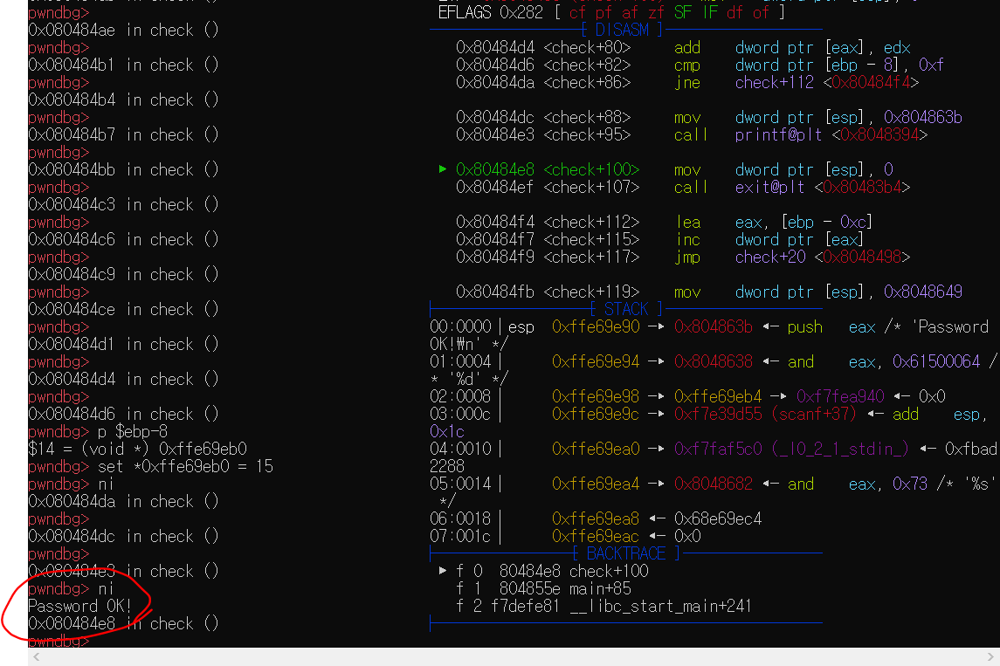

# crackme0x04의 암호를 푸시오.  

## 암호를 풀고, 과정을 남겨보자.  
---
### 우선, 이 문제를 해결하기 위해 2시간정도 삽질하다가, 우리 29기분들의 명석한 두뇌로 어떻게 접근하는지, 또 어떤 방식으로 다가갔는지에 대해 설명을 듣고 풀었다. 29기분들이 아니었다면, 못풀었을걸? 고맙습니당  

일단 모든 실험, 과정들은 crackme 프로그램이 있다고 가정함.  
환경 또한 설치가 되어져있다고 가정하고 시작하겠음.  

우리의 타겟은 crackme0x04 이다.  
이름만 들어도 crack해달란다. 한번 해보자.  

우선 gdb crackme0x04로 들어가보자.  
**그 전에, 32비트인지 64비트인지 알아보자.**   
   
> 32비트인 것을 알 수 있다.  

바로 gdb crackme0x04로 들어가보자.  
사용하기 편리하게, tmux로 화면을 두개로 만들고, ```set context-output tty```로 환경을 만들어놓는다.  
  
요론 삘륑이다. 

벌써 즐겁다.  
일을 하기 쉬워졌으니 말이다.  

하지만 암호를 풀지 못하면, 즐겁지 않다.  
빨리 풀어보자.  

```i file``` 과 ```i func```으로 대략 무슨 함수가 있는지 본다.(~~사실 ```i file```은 아직 활용도를 모르겠다)  

  
보면 함수가 익숙한것들이 있다.  
scanf도 보이고, printf도 보이고.. sscanf도 보이고.. check라는 것도 보인다.  
main도 보일건데, main함수에 가볍게 breakpoint를 걸자.  
> b main 으로 main에 breakpoint를 걸 수 있다.  

main에 breakpoint걸고, run 한 모습.  
  

벌써 아름답다.  
다채롭고 이쁘다.  
저기서 암호를 뽑아보자.  

그 전에, 쓰일 명령어 몇개만 짚어보자.  
[찬솔님의 3일차 링크 참조](https://github.com/ccss17/security-tutorial/tree/master/03-Computer2)  
```
i b : 브레이크포인트  상태보기
d br <location> : 브레이크포인트 삭제.  
ni : 하나의 명령어씩 실행. 단, 서브루틴으로 들어가지 않음.  
si : 하나의 명령어씩 실행. 단, 서브루틴으로 들어감.  

x/s 0x00000000 0x00000000 메모리 값을 string 형식으로 본다.  
```  

자 이제, 빠르게 가보자.  
이렇게 쓰다보면, 나는 오늘 잠을 못자겠다는 생각이 들어서, 굵직한것들로 빠르게 가보겠다.  

ni로 명령어를 실행해보자.  
  
익숙한 명령어가 보인다.  
이게 처음에 print해주는 부분이다.  

  
두번째 프린트다.  
조금 더 가면, scanf가 나온다.  
여기서 scanf 명령이 이루어지는것을 볼 수 있다.  

  

0xffd8ad70에 scanf값이 들어가는 것 같다.  
 
  
확인해보면 이렇다.  

ni로 check 함수까지 가고, si로 함수 안에 들어간다.  


  
strlen 함수를 call 하는 것을 볼 수 있고, 그 아래에 cmp로 eax값과 [ebp-0xc]값을 비교한다.  
jae는 a b 중 a값이 같거나 크면 jmp하는것이다.  
a b 중 a>=b라면 check+119로 가는것같다.  


  

cmp [ebp-0xc], eax는 
cmp 0, 7이다. 여기서 eax는 strlen의 return값이다.  
즉, 나의 input인 'alkfdsj'의 length.  

당연히 0>=7은 성립이 안되므로 check+119로 jmp 안함.  

ni로 계속가보자.  

  
sscanf 라는 함수를 호출한다.  
sscanf는 버퍼에서 포맷을 지정해서 읽어온다.  
포맷이 %d이므로, 숫자를 읽어온다.  
밑에 보면, add도 보이고, cmp와 jne가 보이는데, 뭔가를 더해서 비교하는것같다.  
참고로 jne는 비교결과가 다르면 jmp한다.  
즉, [ebp-8]과 0xf가 다르면 check+112로 점프함.  
0xf는 16진수인데, 10진수로 표현하면 15이다.  

[eax]와 edx를 더한다.  
그리고 ebp-8과 15를 비교해서 같지않으면 check+112로 간다.  
112번에서는 index값을 1증가시키는 부분이다.  
    

%d포맷이니 나도 숫자를 넣어봐야겠다 생각했고, 15와 비교하니, 자릿수를 더해서 15가 되는 465를 input으로 넣었다.  

  

숫자로 input을 넣고, 계속 디버깅을 하며,  
두번째 루프를 돌 때, cmp로 10과 15를 비교하는 것을 확인했다.  
index마다 add해주며 cmp해주는 것이 맞다.  
(465중 4와 6을 저장한 10을 비교함.)  
마지막에 4+6+5의 결과인 15와 15를  비교하는 부분을 확인했다.  
즉, 15와 15를 cmp한 결과가 같기에, check+112로 안가고, check+88로 넘어가는 것을 확인할 수 있었다.  

  
print로 Password OK! 해주는 부분도 확인했다.  

끝.  

---
이 프로그램은, 입력을 받고, strlen를 구해서 loop를 돈다.  
각 index를 add하면서, 15와 같은시점에서 password는 ok가 된다.  
465도 되고, 12345도 된다.  
그런 프로그램이다.  

---
명령어 중 재밌는 것이 있었다.  
나는 이제 어떻게 프로그램이 돌아가는지 알았다.  
근데 메모리값을 set해주는 명령어를 보았다.  
  
input을 hhhhhhh로 넣음.  
될리없다.  

  
이 부분이 통과되면 password는 ok이다.  

ebp-8과 0xf를 비교해서 틀리면 check+112로 jmp한다.  

ebp-8의 메모리값을 알아내서, 0xf로 set해주면 어떻게될까?  

    
위는 check+86다음 check+112가 보였는데, 지금은 check+88이 보인다.  

ni로 계속 실행해보자.  

  

input을 hhhhhhhh로 넣고 password를 통과했다.  
근데 이렇게 하면 프로그램이 실행이 되는지 모르겠다.  
password를 통과한 후(로그인 후), 실행되는 것들도 실행가능한지는 모르겠다.  
애초에 memory값 변조가 안될듯??  
암튼 4번 끝.