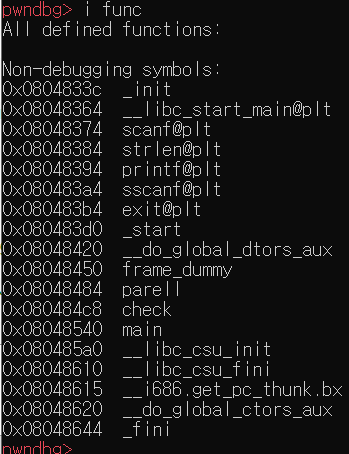
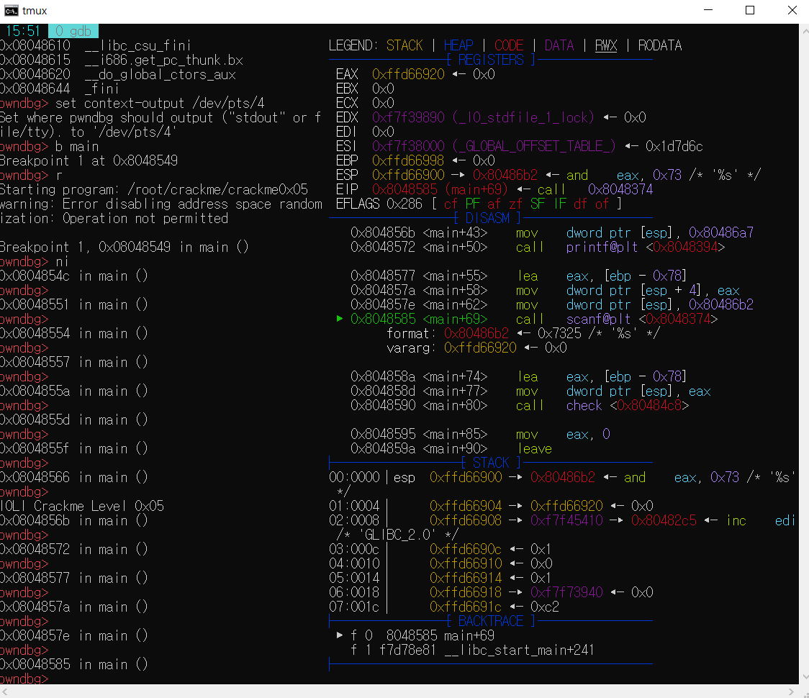
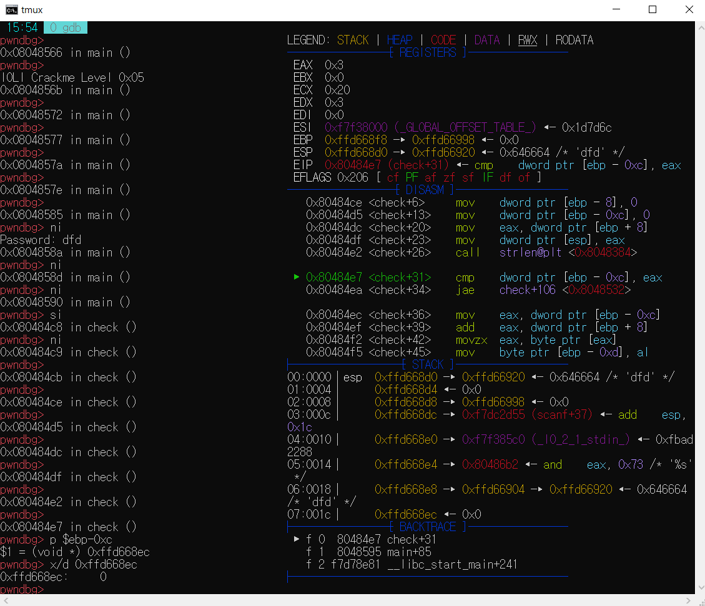
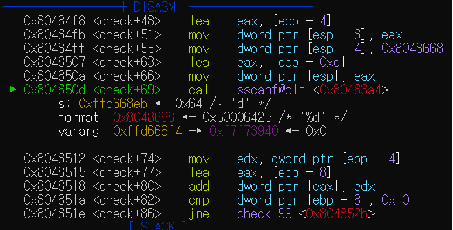
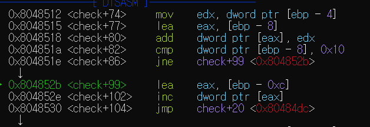
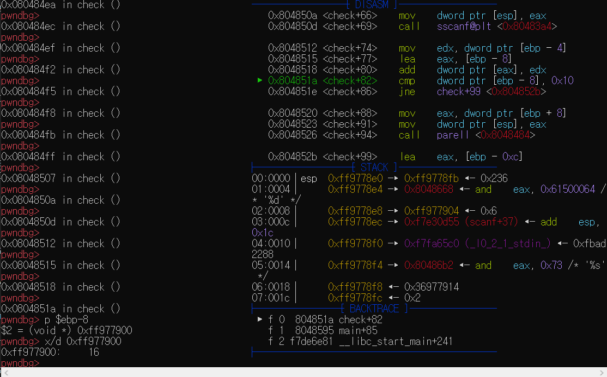
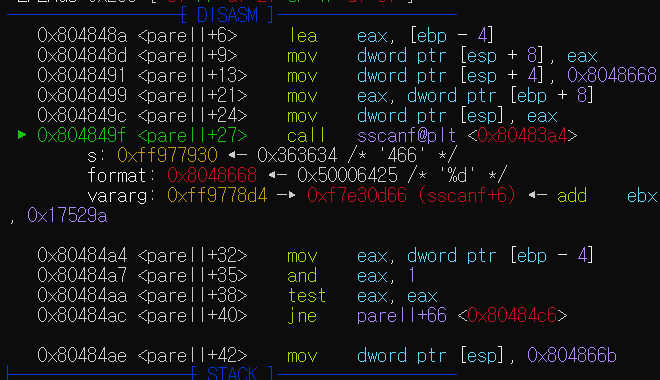
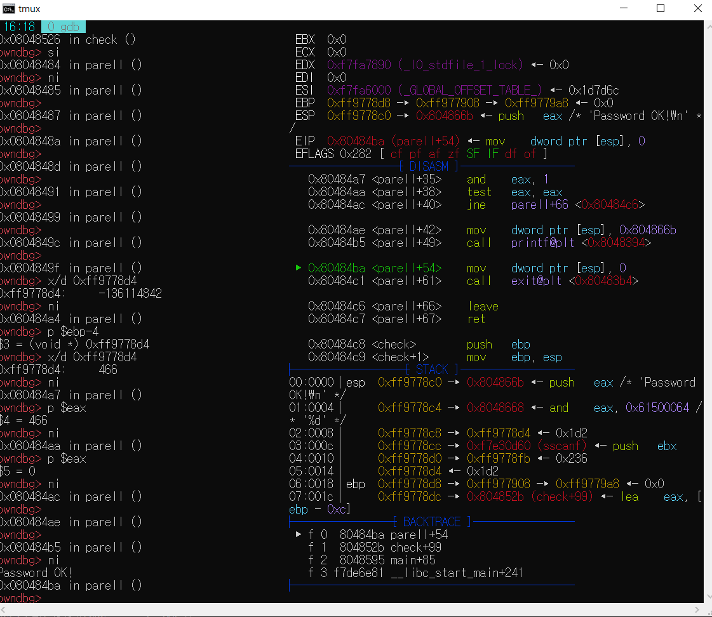
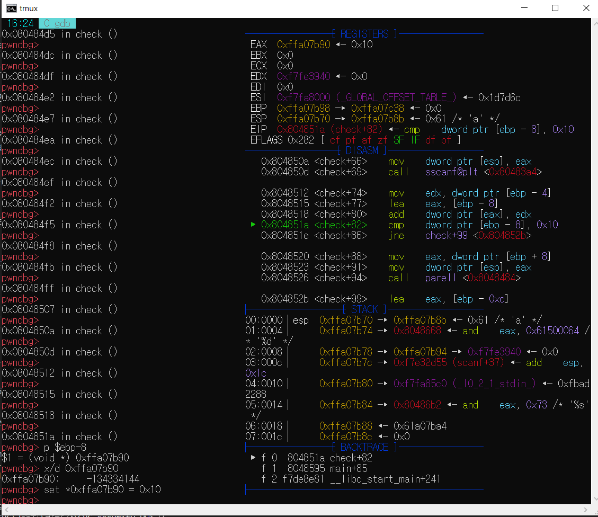
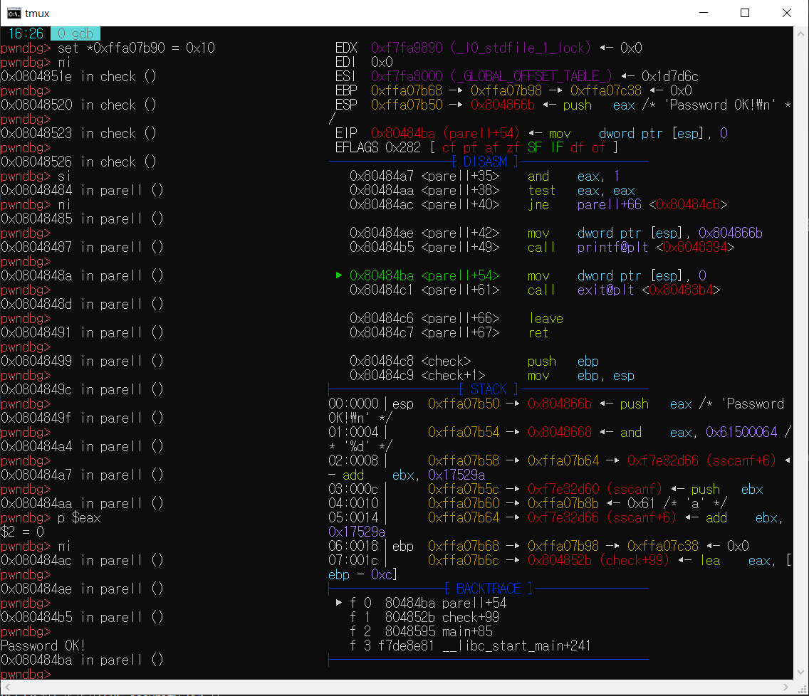

# crackme0x05의 암호를 푸시오.  

## 암호를 풀고, 과정을 남겨보자.  
---
### 우선, 이 문제는 4번을 풀고, 5분만에 바로 5번을 풀어버린 승준이에게 경의를 표시함.  

일단 모든 실험, 과정들은 crackme 프로그램이 있다고 가정함.  
환경 또한 설치가 되어져있다고 가정하고 시작하겠음.  

우리의 타겟은 crackme0x05 이다.  
이름만 들어도 crack해달란다. 한번 해보자.  

32비트 프로그램인 것을 확인했다.  

04번의 markdown에 상세히 자잘한 부분들을 설명했기에, 05번은 아주 간략히 빠르게 가보겠다.  

i func으로 어떤 함수가 있는지 확인해본다.  
   

check와 parell, main함수가 보인다.  
scanf 뭐 이런것도 보인다.  

빠르게 가보자.  
main에 breakpoint를 걸고, run을 시킨다.  

  
printf 2개와 scanf가 보인다.  
scanf까지 가면, 0xffd66920에 문자열이 들어간다.  
그 후, main+80에 있는 check 함수에 진입한다.  

si로 들어가보자.  

  
4번이랑 뭔가 느낌이 비슷하다.  
이전에 봤듯이, 0과 3을 cmp한다.  
0은 첫번째 인덱스를 나타낼것이고(4번처럼), 3은 현재 strlen이다.(return값이 eax에 들어감.)  

0 >= 3 이면 check+106으로 가지만, 아니니 check+36로 얌전히 간다.  

  
4번에서 많이 봤다.  
sscanf고 포맷은 %d다. ~~input으로 정수넣을껄...~~

check+80에 add, check+82에 cmp check+86엔 jne.. 많이 본 느낌이다.  

cmp는 [ebp-8]과 0x10을 비교한다.  
틀리면 check+99로 감.  
0x10은 10진수로 16이다.  
즉, [ebp-8]과 16을 비교.  
4번처럼 index 하나 하나 더해서 16으로 만들어보자.  

input은 466이 좋겠다.  

다시 실행.  
  
인덱스++해주는 부분. 4번과 같다.  

  
[ebp-8]은 16인것을 확인.  
cmp 결과 jne에 걸리지 않음을 확인.(check+88로 넘어가니까)  

하지만 끝이 아니다.  

check+94에서 parell 함수를 call해주는 부분이 있다.  

  
%d포맷으로 sscanf를 한다.  

parell+38에 test가 보인다.  

[출처](https://github.com/ccss17/security-tutorial/tree/master/03-Computer2)  
```
test <op1> <op2> : <op1> 과 <op2> 의 AND 연산 결과가 0일때, FLAG 레지스터의 Zero Flag, 즉 ZF를 True로 셋팅한다.  
```  

확인결과, [ebp-4]는 input숫자인 것을 알 수 있었는데,  

and input, 1 을 하고,
test를 한 비교 결과가 다르면, parell+66으로 jmp한다는 소리이다.  

  
password OK가 뜬다.  

근데 1735도 합이 16인데, 디버깅을 해보면, parell에서 
1735와 1을 add한것이 1이 나와서, 
test 1, 1을 했을때, jne에 걸려서 password가 틀린다.  
~~왜지?~~  

---
memory값을 바꿔보자.  
  
input은 a지만, cmp할때, [ebp-8]의 메모리리값을 0x10으로 바꿔줬다.  
바로 check+88로 갈 수 있는것을 볼 수 있다.  

  
이 부분은 eax값이 0이라 이미 건드릴게 없다.  
이 방법으로도 password ok는 뜬다.  

끝.  