# GBC_security HW-5  
```bomb```의 노란선을 해제하고 write-up을 쓰시오.  

- 일단, file 명령어로 32비트인지 64비트인지 확인한다.  
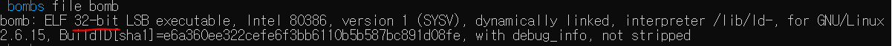  
32-bit임을 확인할 수 있다.  

- gdb로는 ```i func```를 통해서, main 함수가 있음을 알았다.  
더불어, yellow blue 등 다양한 함수를 보았다. b main으로 main 함수에 break point를 걸고 진입해보자.    
- 쭉.... 가다보면, 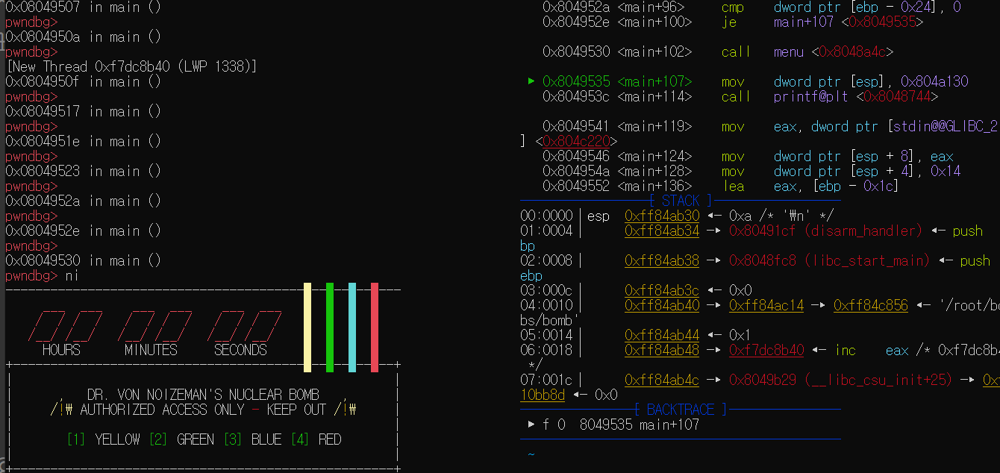  이렇게 메뉴가 print되는 부분을 확인했다.  
- 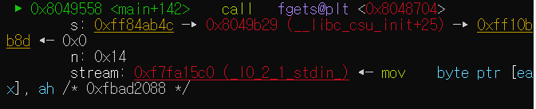  
이 부분이 menu를 선택하는 부분이다.  
- 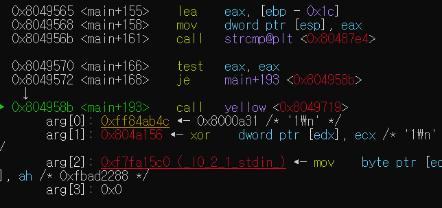  
이 부분은 입력이 1일때, yellow를 call하는 부분이다.  

**잠깐!!**  
```  
이때까지 정리.  
1. main에서 폭탄 형상이 print되고, fgets로 메뉴 선택을 한다.  
2. 그 후, 입력이 1인지 체크하고 1이라면, yellow함수로 간다.  
```  

- 다시 돌아와서, menu selection에서 strcmp(input,"1")이 같다면, yellow 함수를 call 해준다는 것 까지 알았다.  

- 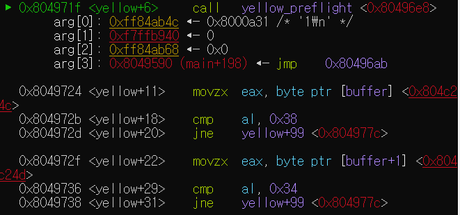  
yellow_preflight 함수를 call 하는 부분이다.  
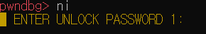라 뜬다.  

**잠깐2**  
```  
이때까지 정리.  
1. main에서 폭탄 형상이 print되고, fgets로 메뉴 선택을 한다.  
2. 그 후, 입력이 1인지 체크하고 1이라면, yellow함수로 간다.  
3. yellow_preflight 함수가 call된 후, <u>ENTER UNLOCK PASSWORD :</u> 가 뜬다.  
```  

- 함수가 call 된 후를 보면, [buffer]를 eax에 넣고 al과 0x38을 비교.  
비교값이 다르면 yellow+99로 jmp한다.  
또 [buffer+1]를eax에 넣어 0x34와 al을 비교하고, 값이 다르면, yellow+99로 이동한다.  

여기서 둘 중 하나라고 추측할 수 있다.  
0x34 != [buffer] -> yellow+99로 jmp.  
yellow+99가 오답이거나 정답하는 분기일것같다.  

-   
여기서 보여지는 분기는 아직 input yellow password를 안한 상태이므로, 분기의 흐름이 저런데, 4일차 crackme를 느껴본바론 이건 buffer[0] == 0x38 , buffer[1] == 0x34가 암호라고 추측할 수 있다.  
즉, input을 넣고 yellow+18과 yellow+20을 지나면 내개 봤을때, yellow+20 다음은 yellow+99로 간다.~~말이 기네..~~  

자 그래서 나는 0x38과 0x34에 해당하는 ASCII code값을 인풋에 넣어주고 그 뒤는 아무렇게나 치겠다.  

input: 840 으로 정했다.  

- 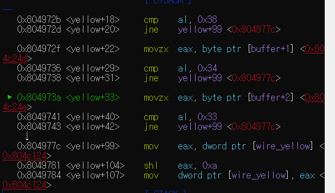  
자 840을 입력하니,  두개의 cmp는 통과.  
[buffer+2]를 eax에 넣고, 0x33과 비교한다.  

즉, 3번째 단어는 0x33의 ASCII code 값인 3이다.  

**이때까지 알아낸 암호. <u>843</u>**  

- 이제부턴 쉽다.  r로 다시 실행해서 8430을 넣고 돌려보자.  
내 생각엔 2분안에 노란줄을 끊을 수 있다.~~다음부턴 귀찮으니깐 b main에 걸린 breakpoint를 지우고 좀 가까운데 다시 설정하자..~~  

- 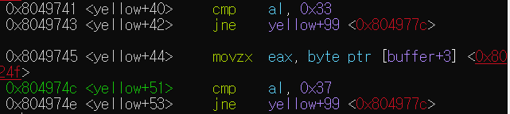  
843다음엔 7  

- 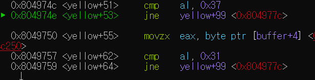  
8437 다음엔 1

- 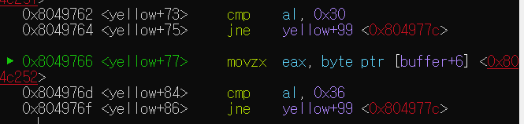  
84371 다음엔 06  

- 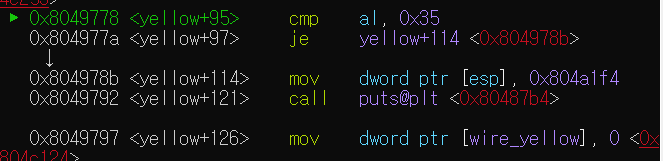  
8437106 다음엔 [buffer+6]과 0x35와 비교하는데, 5가 맞으면 yellow+114로 jmp한다.  
드디어 jmp+99로 안간다.  
그리고 puts 함수를 호출해준다.  
  
이 메세지다.  
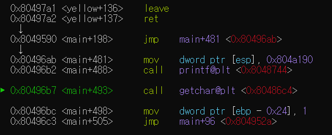  
쭉 가면,  
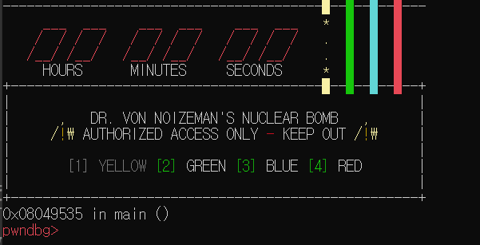  
yellow 선이 끊김.  

> **yellow passwd :<u>8437106</u>**  