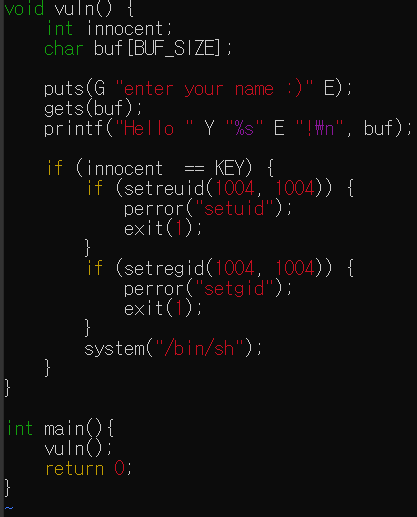
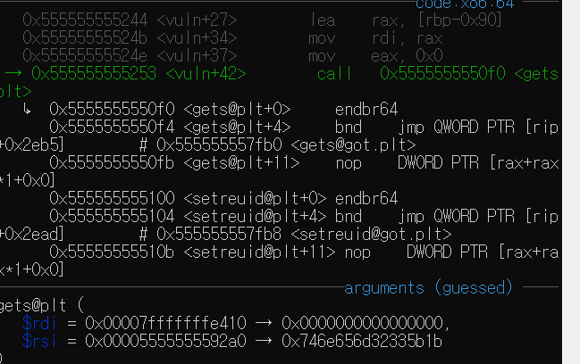
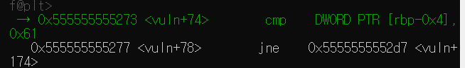
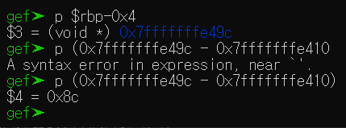
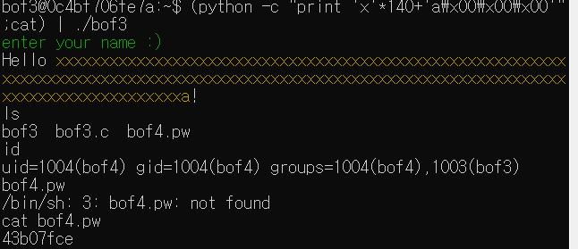

# GBC_security HW6  
## bof3 write-up  

우선, bof4.pw를 볼려면, 권한이 있어야한다.  
그 권한은 bof3의 실행파일이 bof4의 권한으로 실행된다. 
때문에, 이를 잘 이용하면, bof4.pw를 볼 수 있다.  

그 전에, 버퍼 오버플로우에 대해 알아보자.  

> 버퍼 오버플로우는 프로세스가 데이터를 버퍼에 저장할 때, 프로그래머가 지정한 곳 바깥에 저장하는 것을 의미한다.  
벗어난 데이터는 인접 메모리를 덮어쓰게되며, 이때 다른 데이터가 포함될 수 있다. 이는 변수와 프로그램 흐름 제어 데이터도 포함된다.  
[출처 위키백과](https://ko.wikipedia.org/wiki/%EB%B2%84%ED%8D%BC_%EC%98%A4%EB%B2%84%ED%94%8C%EB%A1%9C)  

이제 시작.  

i func으로 main함수가 있는 것을 알았다.  
main함수에 breakpoint를 걸고 run해본다.  

동시에, bof3.c를 보겠다.  

  
참고로 KEY는 0x61로 define되어있다.  
main에선 vuln함수를 실행.  

gets로 buf에 입력을 받고, innocent == KEY인지 비교한다.  
innocent 변수를 잘 조작하면 bof4로 쉘이 시작되어서 bof4.pw를 읽을 수 있다.  

gets 함수와 strcpy함수는 input을 버퍼에 저장할 때 길이 검증없이 데이터를 스택에 복사한다.  
이를 이용한다.

input을 정해진 버퍼의 길이를 초과하면 innocent 변수를 조작가능.  

gdb에서 vuln 함수로 들어가보자.(어차피 main 내용이 vuln하나뿐이다.)  

  
buf의 주소값은 0x7fffffffe410이다.  

  
cmp로 0x61(KEY)과 [rbp-0x4]를 비교하고있다.  
[rbp-0x4]가 innocent다.  

  
이렇게 주소값의 차이를 보면 0x8c가 나온다.  
이는 10진수로 140이다.  

즉, 140만큼 차이가 난다는 것.  

이제, 데이터를 140만큼 덮어쓰면 innocent에 접근이 가능하다.  
140만큼 데이터를 덮어쓰고, innocent에 KEY값을 전달한다면 된다.  

프로그램이 input을 표준입력으로 받는다.  
따라서 |를 통해서 조작된 입력값을 전달할 수 있다.  

(python -c "print 'x'*140+'\x61\x00\x00\x00'";cat) | ./bof3을 통해 bof4.pw에 들어갈 수 있게되었다.  

  
> passwd = <u>43b07fce</u>  