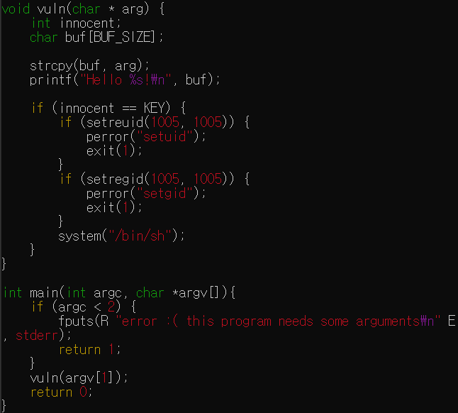
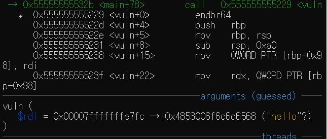
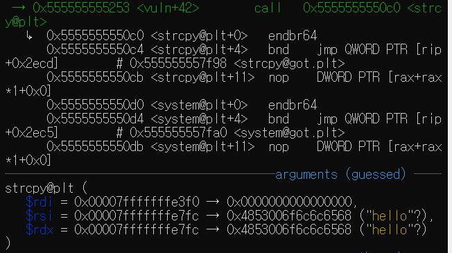
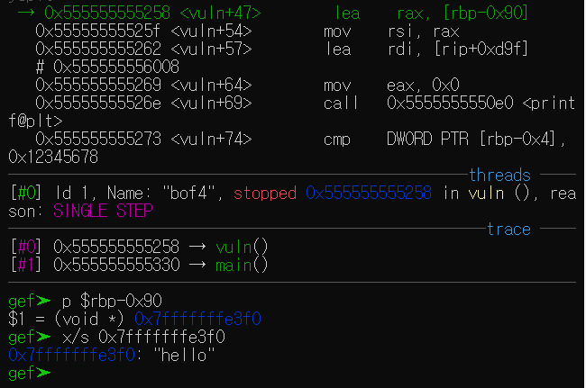
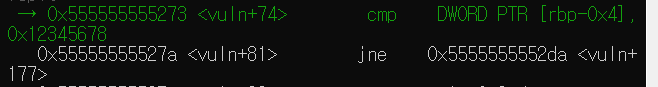
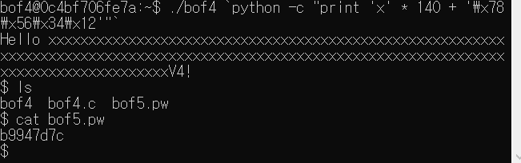

# GBC_security HW6  
## bof4 write-up  

우선, bof5.pw를 볼려면, 권한이 있어야한다.  
그 권한은 bof4의 실행파일이 bof5의 권한으로 실행된다. 
때문에, 이를 잘 이용하면, bof5.pw를 볼 수 있다.  

i func으로 main함수가 있는 것을 알았다.  
main함수에 breakpoint를 걸고 run해본다.  

동시에, bof4.c를 보겠다.  

  
참고로 KEY는 0x12345678로 define되어있다.  
main에선 argv를 인자로 받아 함수에서 strcpy를 쓴다.  

그 후, innocent == KEY인지 비교한다.  
innocent 변수를 잘 조작하면 bof5로 쉘이 시작되어서 bof5.pw를 읽을 수 있다.  

gets 함수와 strcpy함수는 input을 버퍼에 저장할 때 길이 검증없이 데이터를 스택에 복사한다.  
이를 이용한다.

input을 정해진 버퍼의 길이를 초과하면 innocent 변수를 조작가능.  

gdb에서 r hello로 실행해보자.(인자값을 넘기며 실행한다.)  

  
0x7fffffffe7fc에 hello(input이 담김.)  

  
strcpy한다.  
0x00007fffffffe3f0 에 0x7fffffffe7fc 값을 copy함.  

  
검증.  

  
cmp로 [rbp-0x4]와  0x12345678을 비교함.  

p $rbp-0x4 = 0x7fffffffe47c가 나옴.  
이는 innocent의 주소값이다.  

두 거리는, p (0x7fffffffe47c -0x7fffffffe3f0)의 결과.  
0x8c(140)이다.  

이제, 데이터를 140만큼 덮어쓰면 innocent에 접근이 가능하다.  
140만큼 데이터를 덮어쓰고, innocent에 KEY값을 전달한다면 된다.  

프로그램이 input을 실행시 인자로 넘겨받는다.  
라서 인자 140바이트를 주면 innocent직전까지 값이 들어가고, 그 후를 KEY값을 주면 된다.  

./bof4 `python -c "print 'x' * 140 + '\x78\x56\x34\x12'"` 을 통해 bof5.pw에 들어갈 수 있게되었다.  

  
> passwd = <u>b9947d7c</u>  