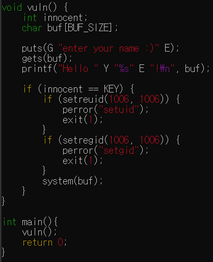
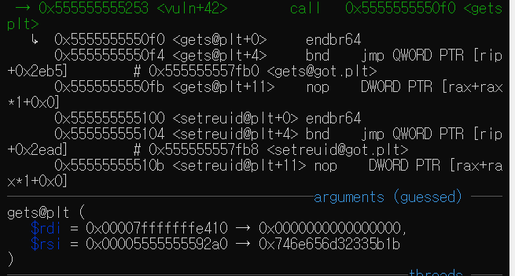
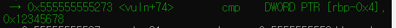
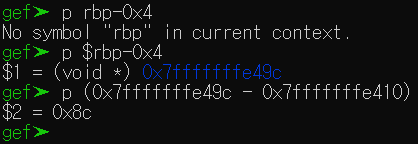
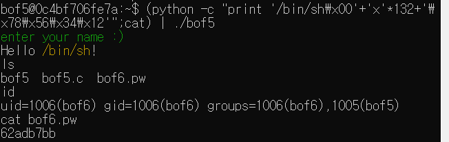

# GBC_security HW6  
## bof5 write-up  

우선, bof6.pw를 볼려면, 권한이 있어야한다.  
그 권한은 bof5의 실행파일이 bof6의 권한으로 실행된다. 
때문에, 이를 잘 이용하면, bof6.pw를 볼 수 있다.  

i func으로 main함수가 있는 것을 알았다.  
main함수에 breakpoint를 걸고 run해본다.  

동시에, bof5.c를 보겠다.  

  
참고로 KEY는 0x12345678로 define되어있다.  
main에서 함수를 호출하고, 함수에서 gets로 input을 입력받는다.  

그 후, innocent == KEY인지 비교한다.  
innocent 변수를 잘 조작하면 bof6로 쉘이 시작되어서 bof6.pw를 읽을 수 있다.  

하지만 이제까지와는 달리, bof5에선 system(buf)가 있다.  

gets 함수와 strcpy함수는 input을 버퍼에 저장할 때 길이 검증없이 데이터를 스택에 복사한다.  
이를 이용한다.

input을 정해진 버퍼의 길이를 초과하면 innocent 변수를 조작가능.  

gdb에서 r로 실행해보자.(b main은 걸어놓고)  

vlun 함수 안으로 들어가보자.  

puts함수 다음, gets함수가 나온다.  

  
gets로 input을 받음.  
0x00007fffffffe410에 buf가 드감.  

  
cmp로 비교.  innocent == KEY부분.  
[rbp-0x4]가 innocent이다.  주소값은 p $rbp-0x4로 확인해보면,  
0x7fffffffe49c가 나옴.  

  

거리는 0x8c(140)이다.  

이제, 데이터를 140만큼 덮어쓰면 innocent에 접근이 가능하다.  
140만큼 데이터를 덮어쓰고, innocent에 KEY값을 전달한다면 된다.  

근데 bof5.c 부분을 다시 보면, innocent==KEY 안에서 system(buf)를 호출한다.  
이제까지는 ```system("/bin/sh");``` 이었는데, 바뀌었다.  
우리는 바뀐 권한으로 쉘을 실행시켜야하기에, 140이라는 buf를 줄 때, "/bin/sh\0"를 넣어주어, system에 buf를 넣어줬을 때, /bin/sh가 실행되게 해야한다.  

그래서, 우리의 input은 "/bin/sh\x00" 8글자를 buf맨 앞에 포함시키고, 남은 132자의 의미없는 값을 주어 140글자를 채운 후, KEY값을 주어야한다.  

따라서 (python -c "print '/bin/sh\x00'+'x'*132+'\x78\x56\x34\x12'";cat) | ./bof5 로 값을 전달하면 bof6.pw에 들어갈 수 있게 된다.

  
> passwd = <u>62adb7bb</u>