# GBC_security HW9  
## bof11 write-up  

1. 분석    
- 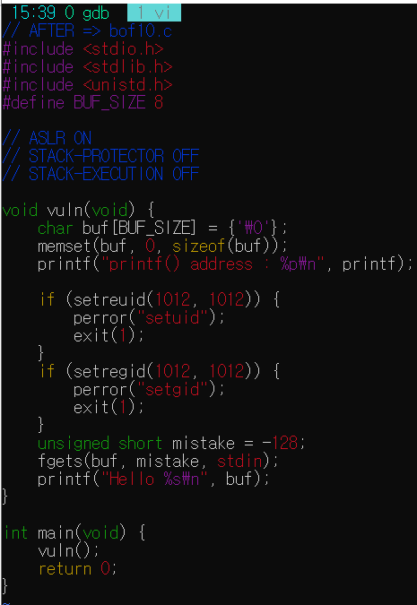 
- fgets의 취약점으로 bof를 적용할 수 있고, printf에서 메모리를 유출시킨다는 가정이다.  
- bof11은 printf를 통해 printf의 address값을 계속 print한다.  
- 하지만 bof11은 스택에 실행권한이 없다. 또 ALSR이 활성화되어있어, 주소값이 계속 바뀐다.  
- 하지만 printf의 함수 주솟값이 유출되고 있다면, 이를 이용해 passwd를 알아낼 수 있다.  
- 이 문제는 bof9와 아주 비슷하다.  
따라서, bof9와 유사하게 system 주소, /bin/sh 주소, pop rdi ; ret 주소를 알아내면 그 값들과 printf의 주솟값과 잘 조합을 해주었을때 passwd를 알아낼 수 있다. 
- 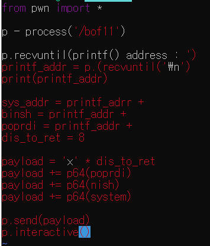  
힌트를 주신대로 우린 printf와 system의 주소의 거리,  
binsh과 printf와의 주소차이, poprdi와의 차이, 리턴값의 차이를 구해야한다.  

2. fgets함수를 통해 vuln함수의 return값과 buf의 거리를 알아낸다. 
- 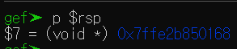  
- 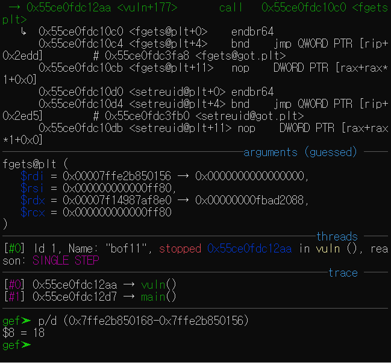  
거리는 18이다.  

3. system과 printf과의 거리.  
- 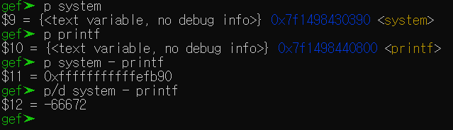  
-66672가 차이난다.  

4. /bin/sh과 printf와의 거리.  
- 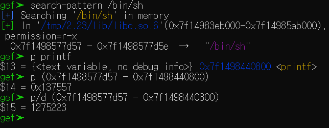  
1275223이 차이난다.  

5. pop rdi ; ret와 printf와의 거리.  
- 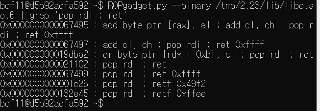  
21102만큼 시작점과 떨어짐.  
- 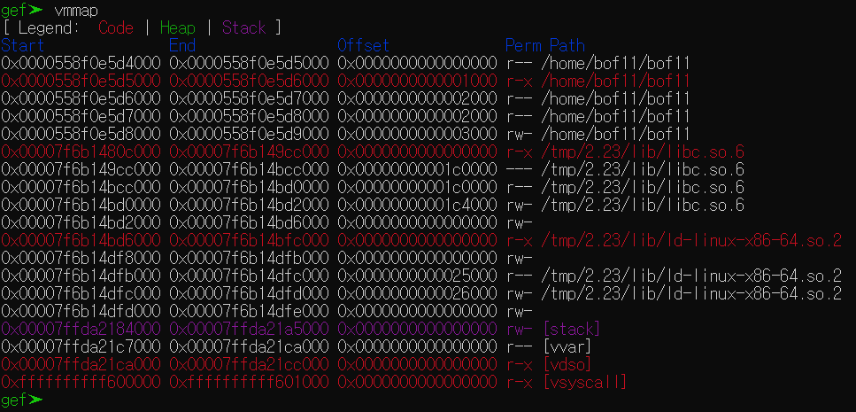  
시작점을 알아옴.  
- 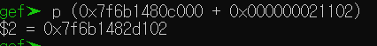  
둘을 더해주고,  
- 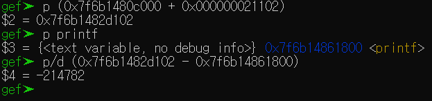  
그 값을 printf의 주솟값과 빼준다.  
-214782가 차이난다.  

6. 다 구했으니 힌트에 숫자를 넣어본다.  
- 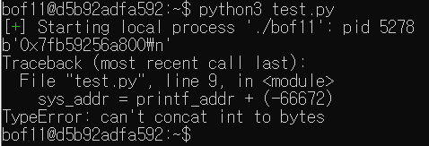  
처음엔 에러가 났다.  
오타도 많았고, 형변환의 문제도 있었다.  

7. 구글 검색과 승준님의 도움으로 해결하였다.  
- 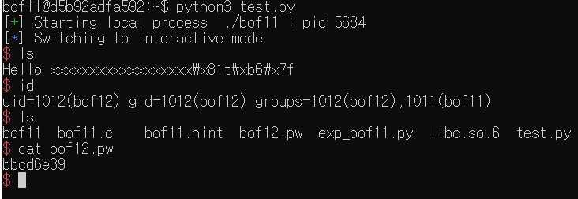  

> bof12 passwd = <u>*bbcd6e39*</u>  